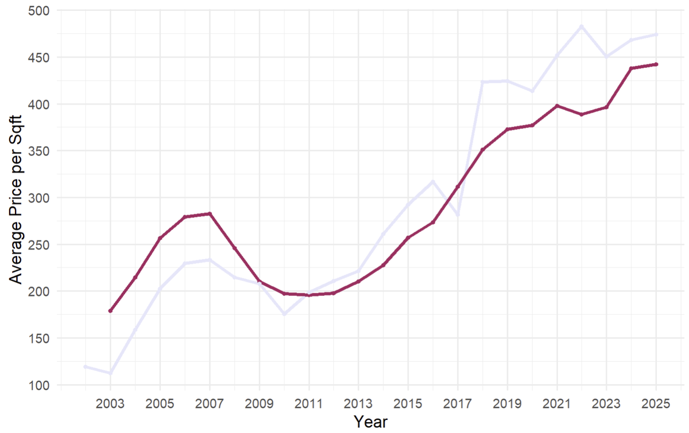
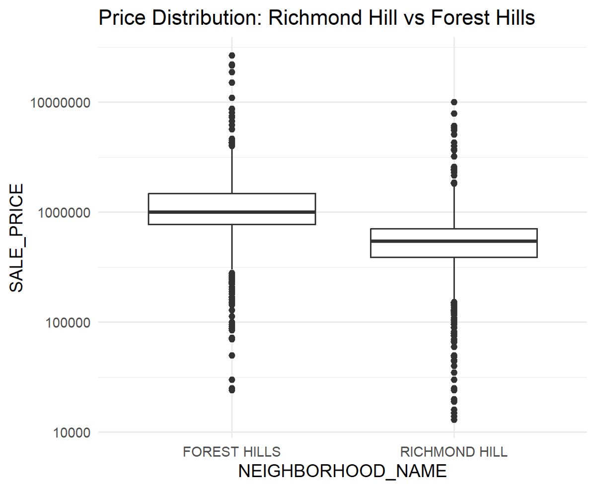
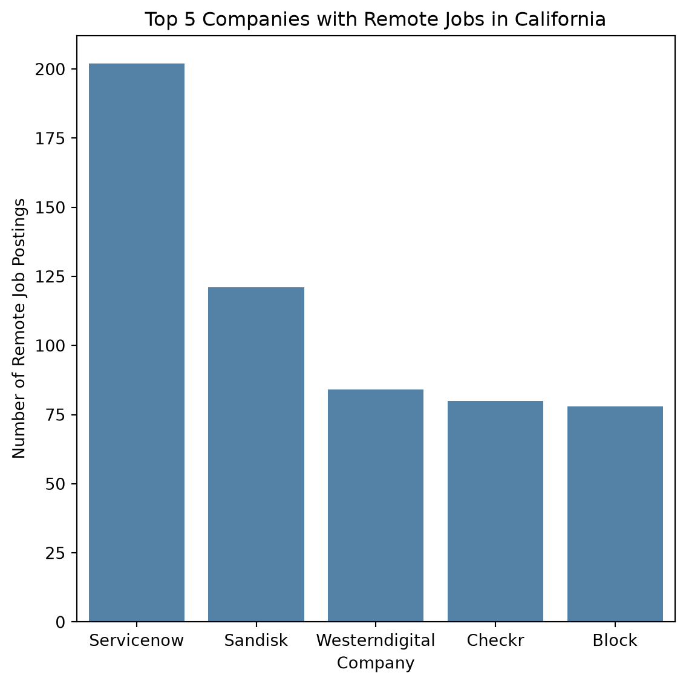

## AP Automation Registry

*Work project · Python, Excel macros and Power Query, Windows Task Scheduler, Claude skills*

I set up a shared registry where our AP team logs every automation we run: what it does, what triggers it, and who maintains it. It gives the team one place to see what already exists before building something new, and makes it easier to hand work off or troubleshoot when something breaks.

**55** automations logged · **47** built by me · **4** tool types

```{mermaid}
flowchart LR
  A[Repetitive task spotted] --> B{Pick the right tool}
  B --> C[Python script]
  B --> D[Excel macro / Power Query]
  B --> E[Windows Scheduled Task]
  B --> F[Claude skill]
  C & D & E & F --> G[Log in shared registry]
  G --> H[Team reuses and maintains]
```

## Richmond Hill Real Estate Insights

*AD571 · Boston University · R, Power BI, Excel Solver*

The case: should a real estate brokerage open an office in Richmond Hill, Queens? I looked at 20+ years of NYC sales data to size up the market, compare it to nearby neighborhoods, forecast revenue, and model what an office would actually need to be profitable.



- **Market:** price per square foot has climbed steadily, but sales volume has dropped since 2021.
- **Comparison:** k-means clustering grouped Richmond Hill with lower-priced, higher-turnover areas. A t-test showed Forest Hills homes sell for about twice as much.
- **Forecast:** a regression model explained about 70% of price variation and projected modest growth over eight quarters.
- **Optimization:** a two-stage solver model landed on 1 employee, 400 sq ft, and a 4.3% commission rate, with an NPV of about $1.4M over eight quarters.

**Recommendation:** open a small pilot office. It's profitable, but the market isn't big enough to support scaling up headcount.



## Job Market Analysis with Spark

## Job Market Analysis with Spark

*AD688 · Boston University · PySpark, Spark SQL, AWS EC2, Quarto*

Working with about 504,000 job postings, I reshaped one wide raw table into a relational model: a postings table linked to company, industry, and location tables by hashed keys. Then I used Spark SQL to answer four questions: which tech occupations pay the most, which companies post the most remote jobs in California, how California postings trend month to month, and how salaries compare across major metro areas.



- **Salaries:** in the computing infrastructure industry, data scientists and software developers topped the list at a median of about $204K.
- **Remote work:** ServiceNow led California remote postings with 202, nearly double the next company.
- **Trends:** California postings climbed through spring 2026 and peaked in June at about 21,000 before falling off.

A lot of the work was data quality. Blank strings had to be converted to real nulls before anything could be counted correctly, metro area codes were filled in on only a tiny share of rows (so most of the cities I compared had no usable data), and some postings were tagged with occupations like "Actors" and "Models" that clearly didn't match the job. I documented those limits instead of forcing the numbers to look clean.